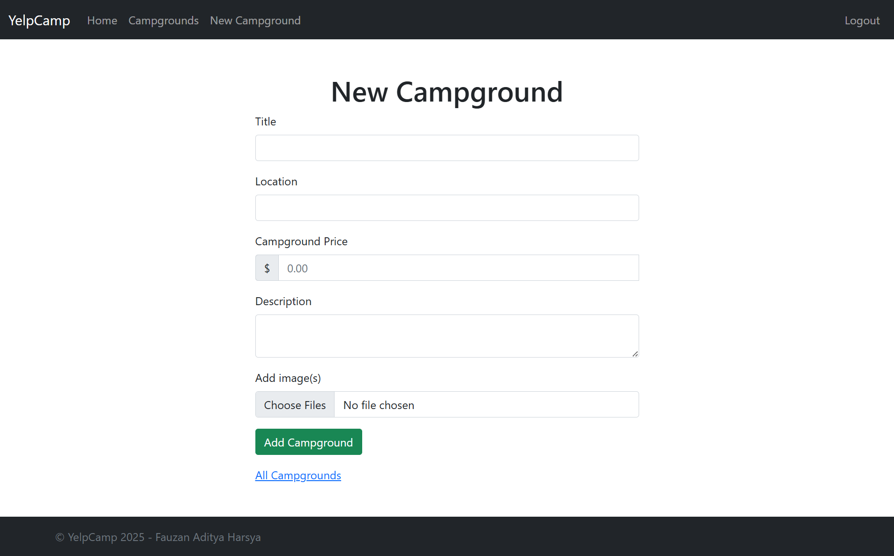

# YelpCamp

A full-stack web application built as the final project for Colt Steele's "The Web Developer Bootcamp" on Udemy. This project is a clone of Yelp, but specifically for campsites. Users can create, review, and browse different campgrounds from around the world.

[](https://yelp-camp-pied-omega.vercel.app/)
---

## Screenshots

<details>
  <summary>Click to Expand Screenshots</summary>
  
  <p align="center"><strong>Landing Page</strong></p>
  <p align="center">
    
  </p>
  <br>

  <p align="center"><strong>Campgrounds Index Page (with Cluster Map)</strong></p>
  <p align="center">
    
  </p>
  <br>

  <p align="center"><strong>Campground Show Page</strong></p>
  <p align="center">
    
  </p>
  <br>
  
  <p align="center"><strong>New Campground Form</strong></p>
  <p align="center">
    
  </p>
  <br>

  <p align="center"><strong>Edit Campground Form</strong></p>
  <p align="center">
    
  </p>
</details>

## Features

*   **User Authentication:** Secure user registration and login using Passport.js.
*   **CRUD Functionality:** Users can Create, Read, Update, and Delete campgrounds.
*   **Authorization:** Users can only edit or delete the campgrounds and reviews they have created.
*   **Image Uploads:** Image uploads are handled using Multer and stored on the Cloudinary cloud service.
*   **Interactive Maps:**
    *   A cluster map on the index page shows all campgrounds, with markers clustering together on zoom-out for better performance and visibility (using MapTiler).
    *   A single location map is displayed on each campground's show page.
*   **Reviews & Ratings:** Authenticated users can add and delete reviews for campgrounds, including a star rating.
*   **Dynamic UI & Feedback:** Flash messages provide feedback to the user after actions (e.g., "Successfully created campground!").
*   **Responsive Design:** The application is fully responsive and built with the Bootstrap framework.

## Tech Stack

This project is built with a classic MEN (MongoDB, Express, Node.js) stack.

*   **Frontend:**
    *   EJS (Embedded JavaScript templates)
    *   Bootstrap 5
    *   MapTiler SDK JS

*   **Backend:**
    *   Node.js
    *   Express.js
    *   Mongoose (ODM for MongoDB)
    *   Passport.js (for authentication)
    *   Multer (for image uploads)
    *   Cloudinary API (for image storage)

*   **Database:**
    *   MongoDB (hosted on MongoDB Atlas)

*   **Deployment:**
    *   Vercel

## Getting Started

To run this project locally, follow these steps.

### Prerequisites

*   Node.js and npm installed.
*   A local or cloud-based MongoDB instance (e.g., from MongoDB Atlas).

### Installation

1.  **Clone the repository:**
    ```bash
    git clone https://github.com/fauzanharsya/YelpCamp.git
    cd YelpCamp
    ```

2.  **Install NPM packages:**
    ```bash
    npm install
    ```

3.  **Set up Environment Variables:**
    Create a `.env` file in the root of the project and add the following variables. You will need to get your own API keys from the respective services.

    ```
    # MongoDB Atlas Connection String
    DB_URL=mongodb+srv://<user>:<password>@cluster.../yelp-camp?retryWrites=true&w=majority

    # Cloudinary Credentials
    CLOUDINARY_CLOUD_NAME=your_cloud_name
    CLOUDINARY_KEY=your_api_key
    CLOUDINARY_SECRET=your_api_secret

    # MapTiler API Key
    MAPTILER_API_KEY=your_maptiler_key

    # A secret for Express Session
    SECRET=useyourownsecretsessionkey

    # (OPTIONAL for seeeding campgrounds in the database) Unsplash access key
    UNSPLASH_ACCESS_KEY=your_unsplash_access_key
    ```

4.  **Run the application:**
    The application will run on `http://localhost:3000`.
    ```bash
    node app.js
    ```
    Or for development with automatic restarts:
    ```bash
    nodemon app.js
    ```

## Acknowledgements

*   This project was built as part of **[The Web Developer Bootcamp](https://www.udemy.com/course/the-web-developer-bootcamp/)** by Colt Steele. The core logic, architecture, and features are based on the course curriculum.
*   All seeded campground images are from the Unsplash API.
